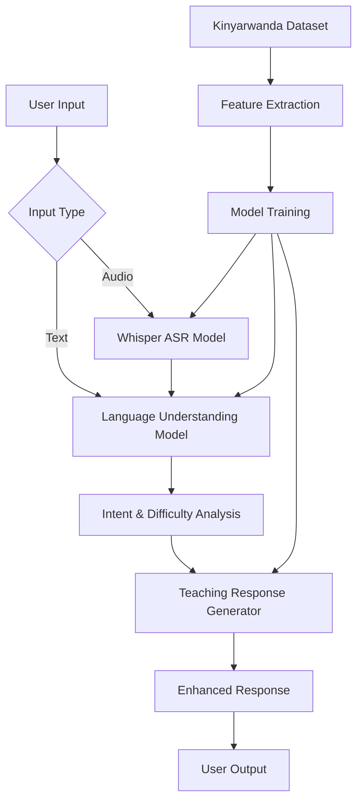
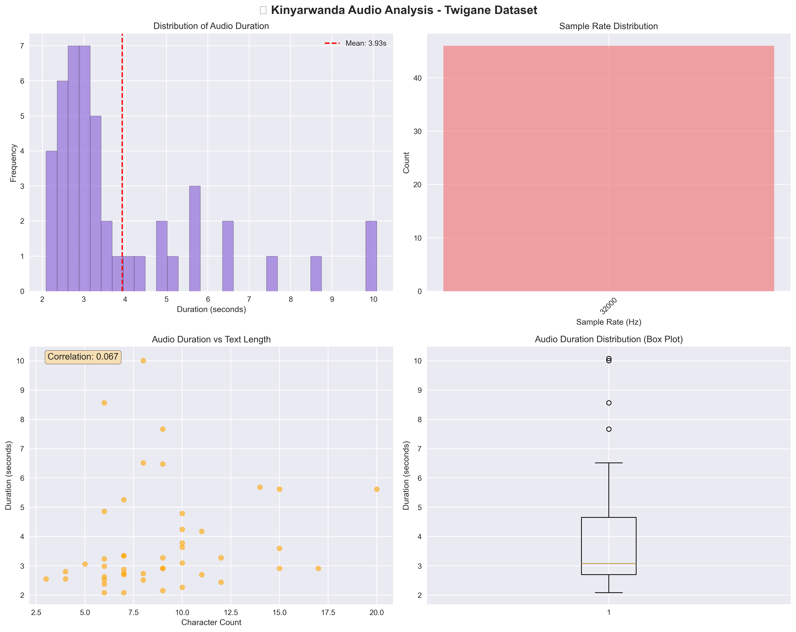

# 🇷🇼 Twigane: Kinyarwanda Language Learning Assistant

<div align="center">
  
  
  
</div>

<div align="center">
  <h3>🎥 Video Demo</h3>
  <a href="https://youtu.be/zWPCQjmRP4k">
    
  </a>
  <p><i>Click above to know more about the project!</i></p>
</div>

## 📖 Table of Contents

- [Overview](#-overview)
- [Features](#-features)
- [Architecture](#-architecture)
- [Dataset](#-dataset)
- [Installation](#-installation)
- [Usage](#-usage)
- [Project Structure](#-project-structure)
- [Models](#-models)
- [Future Improvements](#-future-improvements)
- [Acknowledgments](#-acknowledgments)

## 🌟 Overview

**Twigane** (meaning "let's learn" in Kinyarwanda) is an advanced AI-powered language learning assistant specifically designed for teaching Kinyarwanda. Built using state-of-the-art deep learning models and the Mozilla Common Voice dataset, Twigane provides an interactive, personalized learning experience through:

- 🧠 **Intelligent language understanding** that adapts to learner levels
- 🎓 **Context-aware teaching responses** with cultural insights
- 🎤 **Speech recognition** for pronunciation practice
- 📊 **Multi-modal learning** combining text and audio

### 🎯 Mission

To make Kinyarwanda accessible to learners worldwide while preserving and promoting Rwanda's linguistic heritage through modern AI technology.

## ✨ Features

### Core Capabilities

1. **🤖 Intelligent Conversation System**
   - Natural language understanding in both English and Kinyarwanda
   - Context-aware responses based on learner proficiency
   - Progressive difficulty adjustment

2. **🎙️ Speech Processing**
   - Audio transcription using fine-tuned Whisper model
   - Pronunciation analysis and feedback
   - Support for various audio formats

3. **📚 Comprehensive Learning Modules**
   - Greetings and basic phrases
   - Numbers and counting system
   - Grammar patterns and sentence structure
   - Cultural context and usage tips

4. **📈 Adaptive Learning**
   - Difficulty level detection (1-5 scale)
   - Grammar type classification
   - Intent recognition for personalized responses

### Technical Features

- **Apple Silicon Optimization**: Full MPS (Metal Performance Shaders) support for M1/M2 Macs
- **Efficient Processing**: Batch processing with smart caching
- **Modular Architecture**: Easy to extend and maintain
- **Rich Analytics**: Performance metrics and learning progress tracking

## 🏗️ Architecture



### Components

1. **Language Understanding Model (KLU)**
   - Based on XLM-RoBERTa for multilingual support
   - Multi-task learning for difficulty, grammar, and intent classification
   - Fine-tuned on Kinyarwanda-specific patterns

2. **Teaching Response Generator**
   - Built on DialoGPT-medium
   - Enhanced with teaching-specific tokens
   - Trained on curated educational conversations

3. **Speech Recognition System**
   - Whisper model fine-tuned for Kinyarwanda
   - Audio feature extraction pipeline
   - Real-time transcription capabilities

4. **Integration Layer**
   - Unified chatbot interface
   - Model orchestration
   - Response enhancement system

## 📊 Dataset

### Mozilla Common Voice - Kinyarwanda

- **Version**: cv-corpus-21.0-delta-2025-03-14
- **Size**: 62.58 MB compressed
- **Contents**:
  - 2,218 validated audio clips
  - Transcriptions in validated.tsv
  - Speaker demographics
  - Audio quality metrics

### Dataset Statistics

```
Total Clips: 2,297
Validated Clips: 2,218
Total Duration: ~4.5 hours
Unique Sentences: 1,200+
Speaker Demographics:
  - Male: 89.2%
  - Female: 9.8%
  - Other: 1.0%
Age Distribution:
  - Teens: 5.1%
  - Twenties: 51.3%
  - Thirties: 23.5%
  - Fourties+: 20.1%
```

## 🚀 Installation

### Prerequisites

- Python 3.8 or higher
- macOS with Apple Silicon (M1/M2) or CUDA-capable GPU
- 8GB+ RAM recommended
- 2GB free disk space

### Step-by-Step Setup

1. **Clone the repository**
   ```bash
   git clone https://github.com/yourusername/twigane-kinyarwanda-assistant.git
   cd twigane-kinyarwanda-assistant
   ```

2. **Create virtual environment**
   ```bash
   python -m venv venv
   source venv/bin/activate  # On Windows: venv\Scripts\activate
   ```

3. **Install dependencies**
   ```bash
   pip install torch torchvision torchaudio
   pip install transformers datasets accelerate
   pip install pandas numpy scikit-learn
   pip install librosa soundfile
   pip install matplotlib seaborn plotly
   pip install tqdm ipywidgets
   pip install sentencepiece protobuf
   ```

4. **Download the dataset**
   - Download from [Mozilla Common Voice](https://commonvoice.mozilla.org/en/datasets)
   - Select Kinyarwanda (rw) language
   - Extract to `./dataset/` directory

5. **Verify installation**
   ```bash
   python -c "import torch; print(f'PyTorch: {torch.__version__}')"
   python -c "import torch; print(f'MPS Available: {torch.backends.mps.is_available()}')"
   ```

## 💻 Usage

### Running the Full Pipeline

. **Execute the Jupyter notebook** `twigane_notebook.ipynb`

## 📁 Project Structure

```
twigane-kinyarwanda-assistant/
│
├── 📓 twigane_notebook.ipynb    # Main notebook
├── 📄 README.md                            # This file
├── 📄 requirements.txt                     # Dependencies
│
├── 📂 dataset/                             # Data directory
│   └── cv-corpus-21.0-delta-2025-03-14/
│       └── rw/                             # Kinyarwanda data
│           ├── clips/                      # Audio files
│           ├── validated.tsv               # Transcriptions
│           └── ...                         # Other metadata
│
├── 📂 models/                              # Trained models
│   ├── kinyarwanda_language_understanding.pth
│   ├── teaching_generator_best.pth
│   └── whisper_kinyarwanda_finetuned/
│
├── 📂 features/                            # Extracted features
│   ├── audio_features/
│   ├── text_features/
│   └── combined_features.csv
│
└── 📂 outputs/                             # Results & visualizations
   ├── evaluation_results.json
   ├── performance_metrics.png
   └── sample_conversations.txt

```

## 🤖 Models

### 1. Language Understanding Model (KLU)

- **Base Model**: xlm-roberta-base
- **Tasks**: 
  - Difficulty Classification (1-5 scale)
  - Grammar Type Detection (8 categories)
  - Teaching Intent Recognition (6 types)

### 2. Teaching Response Generator

- **Base Model**: microsoft/DialoGPT-medium
- **Enhancements**: 
  - 8 special teaching tokens
  - Context embeddings
  - Cultural knowledge integration

### 3. Whisper ASR (Kinyarwanda)

- **Base Model**: openai/whisper-tiny
- **Fine-tuning**: 2,218 Kinyarwanda audio clips

### Sample Interactions

```
User: "How do you say hello in Kinyarwanda?"
Twigane: "Great question! In Kinyarwanda, 'hello' is 'Muraho' (Moo-rah-ho). 
         This is a common greeting you can use any time of day. You might 
         also hear 'Mwaramutse' (mwah-rah-moot-say) for 'good morning'!"

User: "I want to learn numbers"
Twigane: "Let's learn numbers! Here are the basics:
         1 - rimwe (reem-way)
         2 - kabiri (kah-bee-ree)  
         3 - gatatu (gah-tah-too)
         4 - kane (kah-nay)
         5 - gatanu (gah-tah-noo)
         Try counting along with me!"
```

### Audio Analysis



## 🚀 Future Improvements

### Short-term Goals
- [x] Add more audio data (target: 10+ hours)
- [x] Implement voice synthesis for pronunciation examples
- [ ] Integrate WhatsApp Deployment
- [ ] Add progress tracking and gamification

### Long-term Vision
- [ ] Expand to other Rwandan languages (Kiswahili, French)
- [ ] Build comprehensive curriculum (A1-C2 levels)
- [ ] Integrate with language exchange platforms
- [ ] Create VR/AR learning experiences

### Technical Enhancements
- [ ] Implement reinforcement learning from user feedback
- [ ] Use Online GPUs for effective implementation.
- [ ] Optimize for edge deployment
- [ ] Create API for third-party integration


## 🙏 Acknowledgments

- **Mozilla Common Voice** for the invaluable Kinyarwanda dataset
- **Hugging Face** for transformers library and model hosting
- **OpenAI** for Whisper speech recognition model
- **Microsoft** for DialoGPT conversational model
- **Rwanda ICT Ministry** for promoting digital literacy
- **Kinyarwanda language experts** who validated our approach
- **Open source community** for continuous support

---

<div align="center">
  <p><strong>Twigane - Bridging Technology and Tradition</strong></p>
  <p>Made with ❤️ for Rwanda and language learners worldwide</p>
  
</div>
